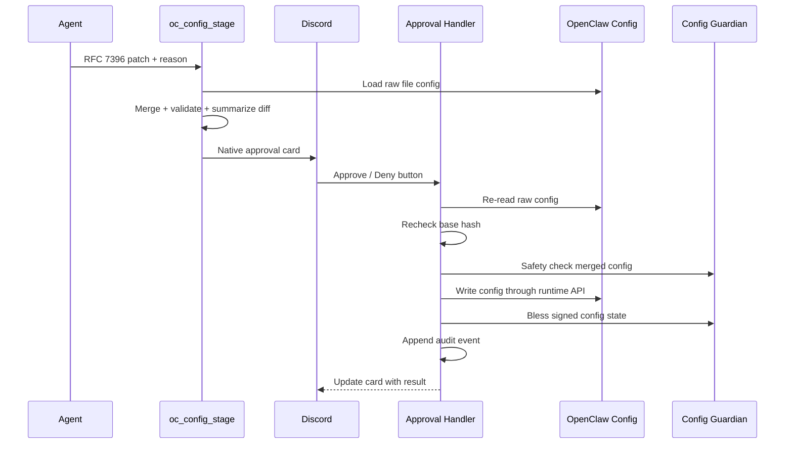

# oc-config-gate

**Approved OpenClaw config control for agents.**

<p align="center">
  <em>RFC 7396 patches · native Discord approvals · validation · blessing · audit trail · safe gateway restarts</em>
</p>

<p align="center">
  <a href="https://github.com/kleinpanic/oc-config-gate/actions/workflows/ci.yml"></a>
  <a href="https://github.com/kleinpanic/oc-config-gate/actions/workflows/security.yml"></a>
  <a href="https://kleinpanic.github.io/oc-config-gate/"></a>
  <a href="https://github.com/kleinpanic/oc-config-gate/wiki"></a>
  
  
  
  
</p>
<p align="center">
  
  
  
  
  
</p>

`oc-config-gate` is an OpenClaw plugin that lets trusted agents propose changes to `~/.openclaw/openclaw.json` without letting them directly edit config or restart the gateway. It stages a JSON Merge Patch, posts a native Discord approval card, and applies only after an authorized operator clicks Approve.

It is the canonical replacement for the older split control plane where `oc-restart`, `oc-config-gate`, and shell guardian scripts each owned part of the same safety flow.

## Status

| Surface | State |
|---------|-------|
| Runtime install | Linked through `openclaw plugins install --link` |
| OpenClaw runtime inspect | `oc_config_stage`, `oc_config_apply`, `oc-config-gate-tool-guard` registered |
| Tests | 13 passing locally and in GitHub Actions |
| Docs site | `https://kleinpanic.github.io/oc-config-gate/` |
| Old repo | `openclaw-oc-restart` is superseded but not archived/deleted |

## Repository Rigor

| Control | Status |
|---------|--------|
| Branch protection | `main` protected after CI/security workflow publication. |
| Required checks | CI matrix, security scan, dependency review on PRs. |
| Dependency automation | Dependabot for npm and GitHub Actions. |
| Release automation | Tag-based GitHub Release with tarball artifact. |
| Issue workflow | Bug and config-safety templates. |
| PR workflow | Validation and safety checklist template. |
| Docs surfaces | README, GitHub Pages, docs directory, and wiki seed. |

## Architecture



For a full write-up, see [docs/ARCHITECTURE.md](docs/ARCHITECTURE.md).

## What It Does

| Surface | Behavior |
|---------|----------|
| `oc_config_stage` | Stages an RFC 7396 config patch and posts an approval card. |
| Discord buttons | Approve applies; Deny discards. No token commands or slash fallback. |
| `before_tool_call` hook | Blocks non-meta direct config edits, config RPCs, and raw restarts. |
| Apply path | Rechecks base hash, validates, safety-checks, writes, blesses, audits. |
| Safe restart | Optional `restart: true` calls `openclaw gateway restart --safe --wait 5m --json` after bless. |

## Install

Local development install:

```bash
git clone https://github.com/kleinpanic/oc-config-gate.git
cd oc-config-gate
npm install
npm test
openclaw plugins install --link "$PWD"
openclaw plugins inspect oc-config-gate --runtime --json
```

Expected runtime inspect:

```json
{
  "status": "loaded",
  "tools": ["oc_config_stage", "oc_config_apply"],
  "hooks": ["oc-config-gate-tool-guard"],
  "diagnostics": []
}
```

Config entry:

```json
{
  "plugins": {
    "entries": {
      "oc-config-gate": {
        "enabled": true,
        "approvalChannelId": "1474492327748960378",
        "pendingTtlMs": 1800000,
        "allowGatewayRestart": true,
        "authorizedDiscordUserIds": ["1014431070059503699"],
        "allowedAgentIds": ["meta"]
      }
    }
  }
}
```

See [docs/CONFIGURATION.md](docs/CONFIGURATION.md) for the full config reference.

## Usage

Stage a config patch from the meta agent:

```json
{
  "patch": {
    "gateway": {
      "reload": {
        "mode": "hybrid",
        "debounceMs": 300
      }
    }
  },
  "reason": "Enable validated hybrid reload for config changes",
  "restart": false
}
```

For a change that needs a full gateway restart:

```json
{
  "patch": {
    "plugins": {
      "entries": {
        "example-plugin": {
          "enabled": true
        }
      }
    }
  },
  "reason": "Load newly installed plugin",
  "restart": true
}
```

Approval cards show the request ID, reason, validation status, change counts, diff preview, expiry, and apply behavior. Approve revalidates everything before writing.

## Tool API

| Tool | Purpose |
|------|---------|
| `oc_config_stage` | Stage a config patch for Discord approval. |
| `oc_config_apply` | Inspect the current pending request. Agent-facing calls are status-only. |

Detailed schemas: [docs/PLUGIN-API.md](docs/PLUGIN-API.md).

## Safety Model

- Only `allowedAgentIds` can bypass the guard. Default: `meta`.
- Non-meta agents are blocked from writing `openclaw.json` directly.
- Non-meta agents are blocked from direct OpenClaw config/update/restart RPCs.
- Non-meta agents are blocked from raw `systemctl`, `pkill`, and `openclaw gateway restart` calls.
- Pending state is written atomically to `~/.openclaw/runtime/pending-config.json` with `0600` permissions.
- Apply fails if the live config hash changed after staging.
- Raw resolved runtime config is never used as the edit base; the plugin reads the file config so `${ENV_VAR}` placeholders stay intact.

More detail: [docs/SECURITY-MODEL.md](docs/SECURITY-MODEL.md).

## Prior Repo Parity

Ported from `openclaw-oc-restart`:

- Discord approval gate
- authorized-user approvals
- pending request state
- audit log writes
- direct restart blocking
- official restart flow after approval

Intentionally removed:

- `approve-restart` / `deny-restart` text tokens
- `/restart-approve` / `/restart-deny` slash commands
- raw shell restart fallback
- deprecated in-process monkeypatching of gateway test internals

## Development

```bash
npm install
npm run check
npm test
npm pack --dry-run
```

The test suite covers native Discord component payloads, status-only apply behavior, stale-base rejection, non-meta config/restart guard behavior, OpenClaw plugin registration, staged restart card behavior, and config validator safety checks.

## Documentation

- [Docs site](https://kleinpanic.github.io/oc-config-gate/)
- [GitHub wiki](https://github.com/kleinpanic/oc-config-gate/wiki)
- [Architecture](docs/ARCHITECTURE.md)
- [Configuration](docs/CONFIGURATION.md)
- [Plugin API](docs/PLUGIN-API.md)
- [Security model](docs/SECURITY-MODEL.md)
- [Release process](docs/RELEASING.md)
- [Contributing](CONTRIBUTING.md)
- [Security policy](SECURITY.md)

## License

MIT. See [LICENSE](LICENSE).
