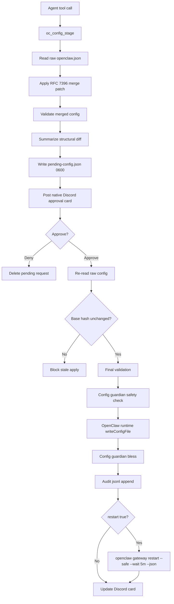

# Architecture

`oc-config-gate` is intentionally small: it is a control-plane plugin, not a config editor UI and not a replacement for OpenClaw's own config system.

## Goals

- Let agents propose config changes without direct file writes.
- Keep the operator approval path native to OpenClaw and Discord.
- Revalidate at apply time, not just stage time.
- Preserve `${ENV_VAR}` placeholders and avoid resolved-secret config writes.
- Make gateway restarts explicit, approved, and routed through OpenClaw's service command.

## Runtime Flow



## Plugin Surfaces

| Surface | Purpose |
|---------|---------|
| `definePluginEntry` | Official OpenClaw plugin entrypoint. |
| `registerTool` | Registers `oc_config_stage` and `oc_config_apply`. |
| `registerHook` | Registers `before_tool_call` guard for direct config/restart attempts. |
| `registerInteractiveHandler` | Handles native Discord button interactions. |
| `runtime.channel.outbound.loadAdapter("discord")` | Posts the approval card through OpenClaw's Discord adapter. |
| `runtime.config.writeConfigFile` | Writes approved config through OpenClaw's runtime API. |

## State Files

| Path | Owner | Notes |
|------|-------|-------|
| `~/.openclaw/runtime/pending-config.json` | `oc-config-gate` | Atomic write, `0600`, one pending request at a time. |
| `~/.openclaw/runtime/oc-config-gate-audit.jsonl` | `oc-config-gate` | Append-only event trail for stage/apply/failure/restart events. |
| `~/.openclaw/openclaw.json` | OpenClaw runtime | Written only after approval and validation. |
| `~/.openclaw/runtime/config-signature.json` | config guardian | Blessing/signature state after approved writes. |

## Why No Raw Systemd

The plugin blocks raw gateway restarts for non-meta agents and does not call `systemctl` itself. If a staged request sets `restart: true`, the approved apply path calls:

```bash
openclaw gateway restart --safe --wait 5m --json
```

That keeps restart behavior aligned with OpenClaw's service abstraction and avoids bypassing gateway-aware drain behavior.

## Prior Implementation Consolidation

The old split system had overlapping responsibilities:

| Old component | Problem | New owner |
|---------------|---------|-----------|
| `oc-restart` CLI/plugin | Token commands, raw fallback, duplicated pending state. | `oc-config-gate` button approval + explicit safe restart. |
| `oc-config-gate` legacy plugin | Partial staging behavior. | This repo. |
| `config-guardian.sh` direct use | Shell-only blessing/safety behavior agents did not understand. | Called by approved apply path. |

