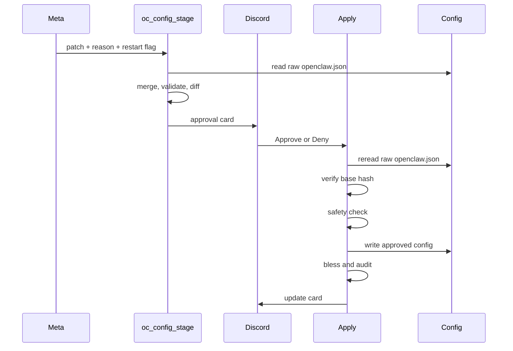

# Approval Flow

```mermaid
sequenceDiagram
  participant Meta
  participant Gate as oc_config_stage
  participant Discord
  participant Apply
  participant Config

  Meta->>Gate: patch + reason + restart flag
  Gate->>Config: read raw openclaw.json
  Gate->>Gate: merge, validate, diff
  Gate->>Discord: approval card
  Discord->>Apply: Approve or Deny
  Apply->>Config: reread raw openclaw.json
  Apply->>Apply: verify base hash
  Apply->>Apply: safety check
  Apply->>Config: write approved config
  Apply->>Apply: bless and audit
  Apply->>Discord: update card
```

Approval is intentionally programmatic. It is not an agentic follow-up prompt, and it is not a slash-command flow.
